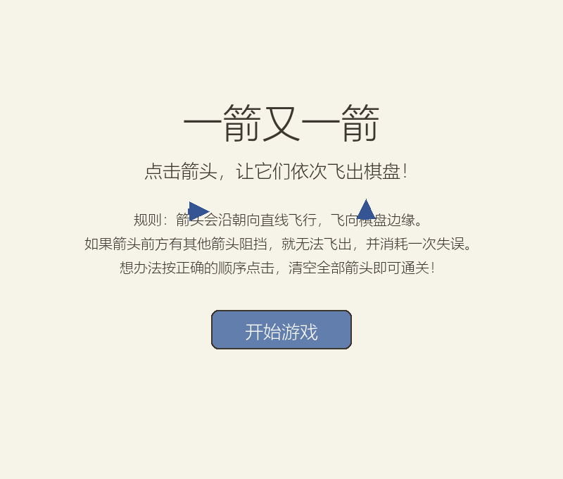
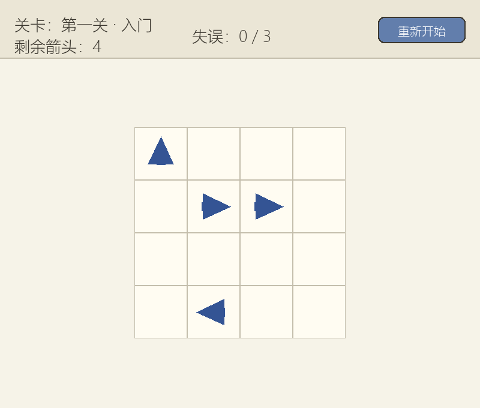
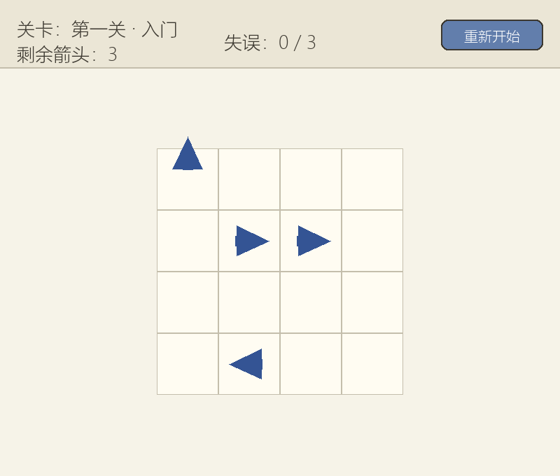
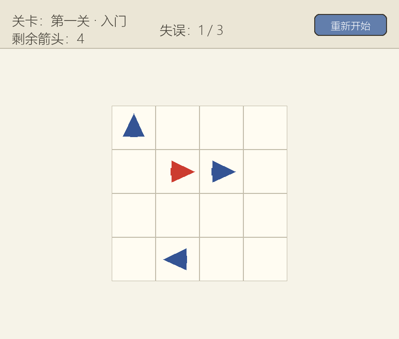
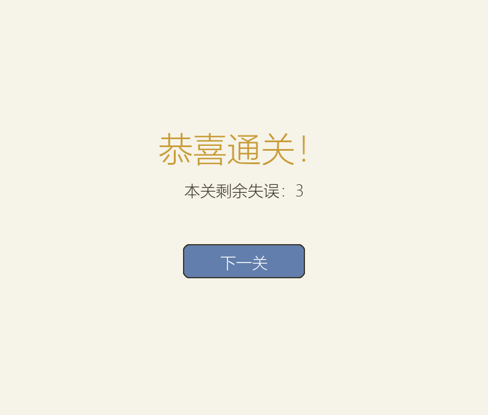

# 一箭又一箭（Arrow Again）

一个基于 Python + Pygame 的点击式箭头解谜小游戏：观察箭头的方向与相互阻挡关系，按正确顺序点击，让所有箭头依次飞出棋盘。

## 游戏简介

棋盘中分布着朝上、下、左、右四个方向的箭头。点击一个箭头后：

- 若箭头朝向方向上到棋盘边界之间**没有其他箭头**，箭头会飞出棋盘并被消除；
- 若路径上存在其他箭头，箭头**不能飞出**，会晃动变红提示碰撞，并消耗一次失误次数；
- 清空本关全部箭头即通关，进入下一关；
- 失误次数耗尽则本关失败，可重新开始。

核心玩法参考微信小游戏《一箭又一箭》，仅参考玩法规则，代码、素材与关卡均为原创。

## 开发环境

- Python 3.10+（本项目在 Python 3.14.7 上开发与测试）
- pygame-ce 2.5.8（社区版，接口与官方 pygame 完全兼容）
  > 说明：官方 `pygame` 目前没有适配 Python 3.14 的预编译安装包，因此本项目使用接口兼容的 `pygame-ce`，代码与官方 pygame 的用法一致。

## 安装和运行方法

```bash
# 1. 安装依赖
pip install -r requirements.txt

# 2. 运行游戏
python main.py
```

运行测试：

```bash
python -m unittest discover -s tests -v
```

## 游戏操作说明

| 操作 | 说明 |
| --- | --- |
| 鼠标左键点击箭头 | 选中箭头并尝试让其飞出 |
| 点击“重新开始”按钮 | 当前关卡恢复到初始状态 |
| 通关后点击“下一关” | 进入下一关（最后一关后返回开始界面） |
| 失败后点击“重新开始” | 重新挑战当前关卡 |

界面说明：

- **开始界面**：游戏标题、玩法规则与“开始游戏”按钮；
- **游戏界面**：顶部显示当前关卡、剩余箭头数量、剩余失误次数与“重新开始”按钮，中部为棋盘；
- **通关/失败界面**：显示结果文字与操作按钮。

## 游戏截图

开始界面：



游戏界面（第一关）：



箭头飞出动画：



碰撞反馈（红色晃动 + 失误 +1）：



通关界面：



失败界面：


## 项目结构

```
arrow-again/
├── main.py               # Pygame 图形界面：开始/游戏/通关/失败界面与动画
├── game_logic.py         # 核心逻辑：箭头/棋盘表示、路径检测、会话状态
├── levels.py             # 关卡数据与可解性自检
├── tests/
│   ├── test_core.py      # 核心逻辑测试（覆盖 T01~T06 等）
│   └── test_smoke.py     # 界面冒烟测试（无窗口驱动完整流程）
├── screenshots/          # 游戏截图
├── render_check.py       # 截图生成脚本（可重新生成 screenshots/ 下的图片）
├── requirements.txt
└── README.md
```

## 测试记录

| 编号 | 测试内容 | 预期结果 | 实际结果 | 是否通过 |
| --- | --- | --- | --- | --- |
| T01 | 点击前方无阻挡的箭头 | 箭头飞出棋盘并消失 | 箭头被移除，剩余数量减 1 | ✅ |
| T02 | 点击前方有阻挡的箭头 | 箭头不消失，失误次数 +1 | 箭头保留，失误次数 +1 | ✅ |
| T03 | 点击位于边缘且朝向棋盘外的箭头 | 箭头正常消失，不发生越界错误 | 正常飞出，无越界 | ✅ |
| T04 | 消除本关全部箭头 | 显示通关并进入下一关 | 进入通关界面，可进入下一关 | ✅ |
| T05 | 失误次数耗尽 | 显示失败并允许重新开始 | 显示失败界面，可重新开始本关 | ✅ |
| T06 | 游戏进行中重新开始 | 箭头布局和失误次数恢复 | 布局与失误均恢复初始状态 | ✅ |

## 项目说明

- **路径检测**：从箭头所在格沿其方向逐格前进，若在棋盘边界前遇到其他箭头则判定为“被阻挡”，否则“可飞出”。
- **关卡可解性自检**：`game_logic.is_solvable()` 通过贪心模拟验证关卡能否通关，程序启动时会自动校验内置关卡，避免出现死锁关卡。
- **动画反馈**：飞出时箭头沿方向移出屏幕；碰撞时箭头在原位左右/上下晃动并变红。
- 本项目在开发过程中使用了 AIGC 工具辅助完成代码编写、调试与测试设计，详细记录见课程博客。

## 许可证

仅供课程学习使用。
